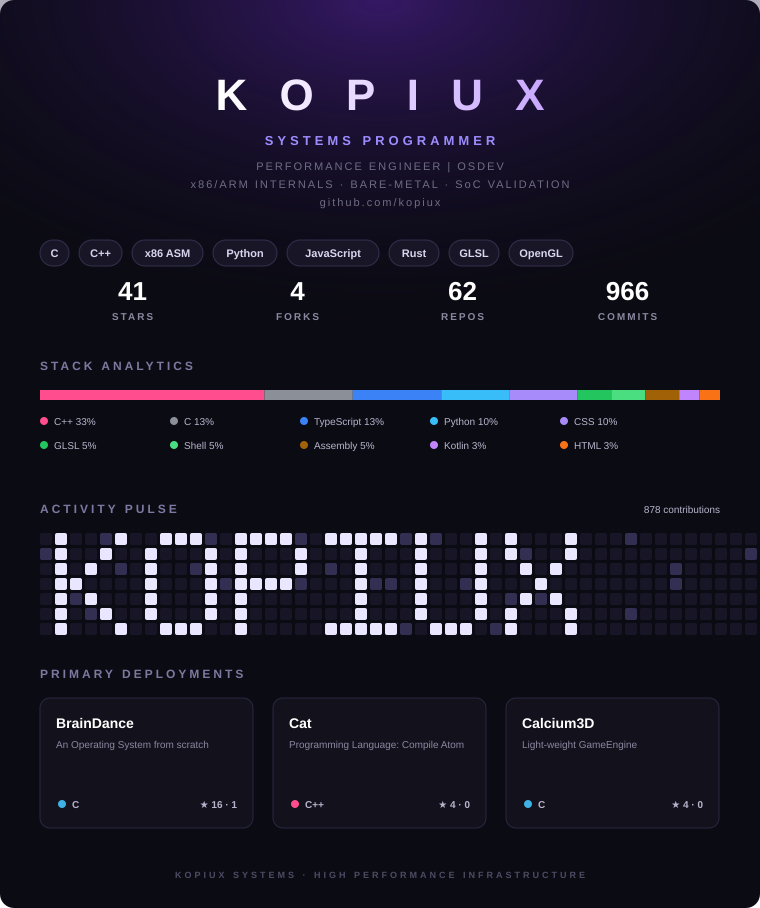

 <!-- Replace card.svg with your own generated version (see generate_card.py), then host it in this repo and reference it below. GitHub profile READMEs live in a special repo named exactly the same as your username, e.g. github.com/KopiUX/KopiUX -->  
 <!-- HOW THIS WORKS ---------------- 1. This whole card is a single SVG image, not live GitHub markdown/CSS — GitHub strips most inline styles from README HTML, so custom dashboard README's like this are built as one static (or auto-generated) image. 2. generate_card.py builds card.svg from a CONFIG dict at the top of the file: name, tags, stats, language breakdown, and project cards. 3. To keep the stats live, wire generate_card.py into a small script that pulls real numbers from the GitHub API (stars/forks/repos/commits, language percentages) and commit the refreshed card.svg on a schedule via GitHub Actions. A starter workflow is below. -->
